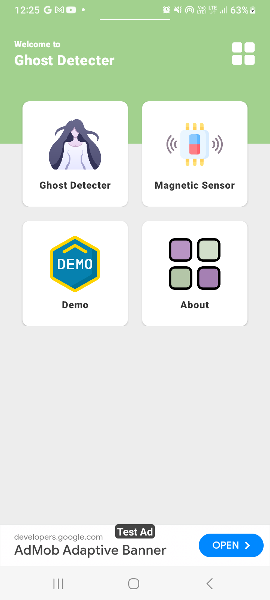
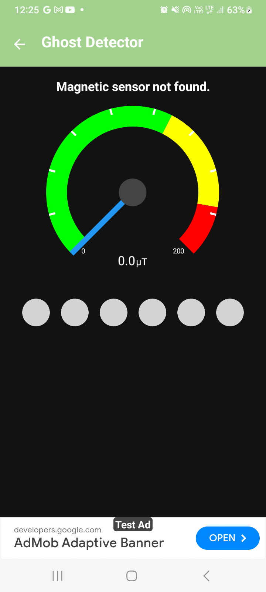

# Ghost Detector App

## Download

## App Description

Ghost Detector is an innovative Android application that uses your device's magnetic field sensor to detect potential paranormal activities. Whether you're a ghost hunter or just curious about supernatural phenomena, this app provides an exciting way to explore the unseen.

## Features

- 🔮 Magnetic Field Detection
- 📧 Compass Navigation
- 🔦 Flashlight Utility
- 👻 Ghost Detection Indicator
- 📊 Real-time Sensor Readings

## Screenshots

|                                |                                |
|:-------------------------:|:-------------------------:|
|  |   |
|  |   |

## Compatibility

- Requires Android 6.0+
- Magnetic Field Sensor Required
- Works best on devices with orientation sensor

## How It Works

1. Open the app
2. Allow sensor permissions
3. Move around and observe magnetic field changes
4. Watch the ghost detection indicators

## Disclaimer

This app is for entertainment purposes only. It does not scientifically prove the existence of ghosts.

## Privacy Policy

- No personal data collected
- Minimal device sensor access
- Ad-supported free app

## Support

For issues or suggestions, please contact our support team.

## License

© 2023 ArrowWould. All Rights Reserved.
